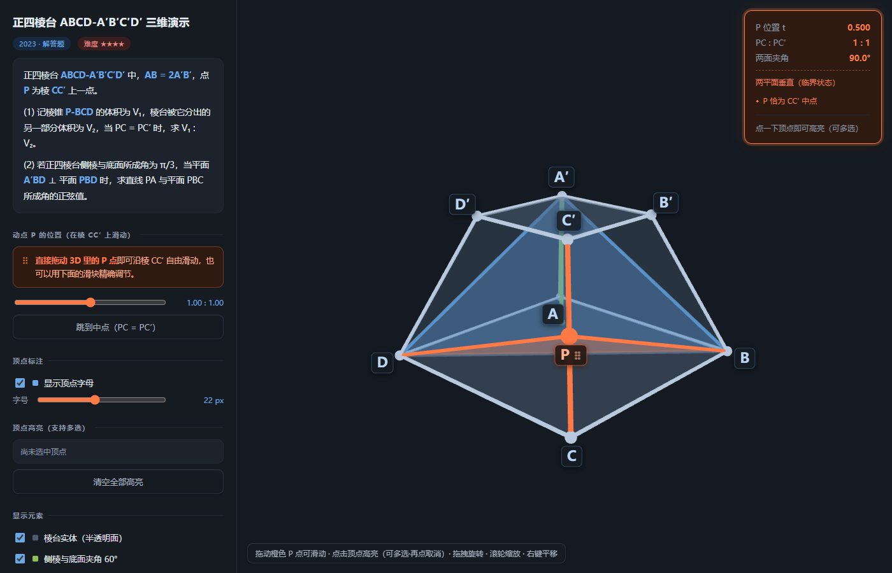

# Modeling display

[](LICENSE)
[](CHANGELOG.md)
[](https://threejs.org/)

**把一道几何题，变成学生可以自己拖着玩的三维教学模型。**

输入一道题（文字或截图），输出一个**单文件 HTML** —— 可旋转缩放平移、点顶点高亮（支持多选）、**手指直接拖动动点**、实时数值读数，同一份文件同时适配电脑与平板。

为高中数学家教场景设计。核心判断：几何题里那个"按数学关系运动的点"，**让学生自己拖着看角度变化，比看任何动画都有效**。



---

## 特性

| 能力 | 说明 |
|---|---|
| **动点自由拖动** | 屏幕坐标反投影为世界射线，求射线与棱的**最近点解析解**。精度 2.9e-15，而常见的"屏幕线段投影法"有 1.15% 误差——透视下三维棱的等分点在屏幕上并不等分，学生一眼就能看出读数不对 |
| **顶点多选高亮** | 屏幕空间命中检测（不用 Raycaster，手指远比小球粗）。点空白**不清空**已有高亮——讲课时手指极易扫到空白区 |
| **双端同一份文件** | 电脑上是静态侧栏，平板（≤1024px 或触屏）自动变抽屉；**竖屏从底部升起** |
| **标签自动避让** | 侧向平视时上底面两个顶点投影间距实测仅 11.6px，用松弛算法推开到 41px |
| **实时读数** | 动点参数、线段比、两面夹角随拖动刷新；满足临界条件时读数区变色提示 |
| **零依赖部署** | Three.js r146 UMD，CDN 优先 + 同目录离线兜底。`file://` 双击即可打开 |

---

## 快速开始

### 作为 AI Agent Skill 使用（推荐）

**方式 A —— 直接克隆到 skill 目录**（只是想用）

```bash
# WorkBuddy
git clone https://github.com/qeqe312/modeling-display.git \
    ~/.workbuddy/skills/modeling-display

# Codex
git clone https://github.com/qeqe312/modeling-display.git \
    ~/.codex/skills/modeling-display
```

**方式 B —— 仓库与部署分离**（推荐长期维护，skill 目录保持干净）

```bash
git clone https://github.com/qeqe312/modeling-display.git
cd modeling-display
python scripts/deploy.py          # 部署到 WorkBuddy 与 Codex 两处
```

这样 Git 仓库是唯一真相源，`~/.workbuddy/skills/` 与 `~/.codex/skills/` 只作为**部署目标**，里面没有 `.git`、没有 GitHub 门面文件。

```
modeling-display/            ← 仓库（Git，唯一真相源）
        │ scripts/deploy.py
        ├──→ ~/.workbuddy/skills/modeling-display/
        └──→ ~/.codex/skills/modeling-display/
```

> **改内容只改仓库**，然后跑 `deploy.py`。直接改 skill 目录里的副本会在下次部署时被覆盖。

然后直接对 AI 说：

> 把这道题做成三维演示：`<题目文字或截图>`

AI 会读取 `SKILL.md`，按里面的契约执行：先解题 → 建参数化坐标系 → 用 `assets/template.html` 起手 → Node 独立验算数学 → headless Chrome 自测交互 → 交付。

Codex 用户也可以用斜杠命令（把 `prompts/geo3d.md` 放到 `~/.codex/prompts/`）：

```
/geo3d 正四棱台 ABCD-A′B′C′D′ 中，AB = 2A′B′，点 P 为棱 CC′ 上一点……
```

### 手动起手

复制 `assets/template.html`，改三段配置：

| 段 | 内容 |
|---|---|
| 【A】题目文案 | 标题、标签、题干、分问卡片、解题步骤 |
| 【B】几何数据 | 顶点坐标、实体面、棱、动点定义 |
| 【C】动态对象 | 依赖动点的平面 / 棱锥 / 线面角 |

替换 14 个 `__XXX__` 占位符即可。**【D】引擎之后不要动** —— 相机、命中、拖动、手势、标签、双端适配都在那里，已验证。

---

## 目录结构

```
modeling-display/
├── SKILL.md                    主契约：输入/输出格式、流程、结构要求、硬性约束、失败模式
├── references/
│   ├── implementation.md       相机、命中检测、拖动解析解、手势三路分流、标签避让、几何构建
│   ├── visual-theme.md         暗色色板、3D 配色、胶囊标签规范、对比度自检
│   └── verification.md         Node 数学验算清单、浏览器交互自测 12 项、调试句柄
├── assets/
│   └── template.html           单页骨架（改【A】【B】【C】三段即可换题）
├── examples/
│   ├── 正四棱台2023真题演示.html   2023 新高考Ⅰ卷正四棱台题完整产出
│   └── preview.png
├── scripts/
│   └── deploy.py               部署到 WorkBuddy / Codex 的 skill 目录
├── prompts/
│   └── geo3d.md                Codex 斜杠命令 /geo3d（复制到 ~/.codex/prompts/）
├── CHANGELOG.md
├── LICENSE                     MIT
└── README.md
```

---

## 示例

`examples/正四棱台2023真题演示.html` —— 2023 新高考Ⅰ卷正四棱台题的完整产出。

- 拖动 P 点沿棱 CC′ 滑动，实时看两面夹角从 60° 增至 90°（t=1/2 处）再回到 60°
- 点顶点高亮（多选），讲面对角线、异面直线时用
- 双端可用

> 离线打开需要把 `three.min.js`（r146 UMD）放到同目录；在线则自动走 CDN。

---

## 设计要点

### 三条不能妥协的技术决策

1. **Three.js r146 的 UMD 构建，不用 ESM。** 新版必须走 `importmap`，在 `file://` 协议下因 CORS 直接失败 —— 学生双击打不开。
2. **拖动动点用射线–棱最近点解析解，不用屏幕线段投影。** 后者在透视投影下有 1.15% 误差：学生把点拖到"看起来正好在端点"的位置，读数却是 0.9885。
3. **命中检测用屏幕空间，不用 Raycaster。** 手指远比顶点小球粗，射线打在小球上基本打不中。

### 两道强制验证关卡

任何产出都必须通过：

1. **Node 独立重写一遍数学**（不复用页面代码），验证题目条件、比值、解析解与数值解一致，误差 < 1e-9
2. **headless Chrome 派发真实 PointerEvent**，跑 12 项交互断言，包括"拖拽动点时相机漂移 = 0"、"新增功能不得破坏既有能力"

> 教训：验算脚本自己也会错。曾因把动点坐标写死成端点值而非真正插值，误报"页面结论错误"—— 页面一直是对的。

### 暗色主题

只用暗色。`#0D1117` 冷黑底 + `#6BA8E8` 学术蓝 + `#FF7A45` 动点橙。所有文字对比度 ≥ WCAG AA，正文达 AAA。

顶点标签用**深色胶囊底**（不用纯描边字）—— 保证字母压在半透明平面和棱线上时依然清晰可读。

---

## 兼容性

| 环境 | 状态 |
|---|---|
| WorkBuddy | ✅ skill 直接可用 |
| Codex | ✅ skill + `/geo3d` 斜杠命令 |
| 其他 AI Agent | ✅ `SKILL.md` 是自包含的 Markdown 契约，人工加载即可 |
| Chrome / Edge / Safari / Firefox | ✅ 现代浏览器，`file://` 双击可开 |
| iPad / Android 平板 | ✅ 触摸目标 ≥44px，抽屉式面板，安全区适配 |

---

## License

[MIT](LICENSE) © 2026 32688

可自由使用、修改、分发，包括商业用途，只需保留版权声明。
