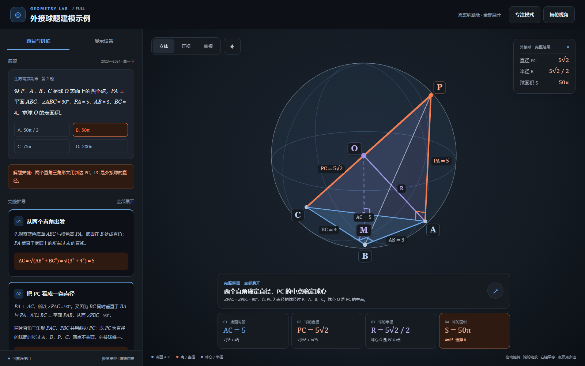
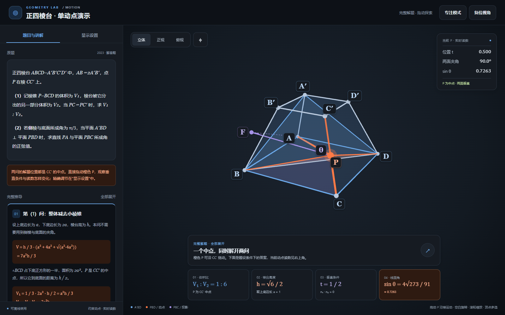

# 几何教学示例

这里保存用户指定的 skill 示例，每题分别保留成品和完整开发资料。演示默认采用“完整解题＋显示设置”布局，电脑使用侧栏，平板竖屏使用底部抽屉、横屏使用左侧抽屉。

| 示例 | 打开成品 | 参照导读 | 示例用途 |
|---|---|---|---|
| 外接球题建模示例 | [外接球题建模示例.html](外接球题建模示例/成品/外接球题建模示例.html) | [REFERENCE.md](外接球题建模示例/REFERENCE.md) | 固定模型、完整推导、外接球与显示设置 |
| 正四棱台2023真题演示 | [正四棱台2023真题演示.html](正四棱台2023真题演示/成品/正四棱台2023真题演示.html) | [REFERENCE.md](正四棱台2023真题演示/REFERENCE.md) | 单动点约束拖动、滑条同步、相机锁定与实时读数 |
| 正四面体内外接球与对棱夹角 | [正四面体内外接球与对棱夹角.html](正四面体内外接球与对棱夹角/成品/正四面体内外接球与对棱夹角.html) | [REFERENCE.md](正四面体内外接球与对棱夹角/REFERENCE.md) | 两球共心、四面相切、对棱平移方向与四项判断 |
| 菱形沿AM翻折与动点 | [菱形沿AM翻折与动点.html](菱形沿AM翻折与动点/成品/菱形沿AM翻折与动点.html) | [REFERENCE.md](菱形沿AM翻折与动点/REFERENCE.md) | 固定折痕翻折、圆弧直接拖动、中点联动、播放与角度同步 |
| 椭圆动圆切线与定距离（二维） | [椭圆动圆切线与定距离.html](椭圆动圆切线与定距离（二维）/成品/椭圆动圆切线与定距离.html) | [REFERENCE.md](椭圆动圆切线与定距离（二维）/REFERENCE.md) | Canvas 2D、等单位坐标、切线射线实虚线、圆周/轨迹拖动与定点定长 |

改编题目时先阅读对应的 `REFERENCE.md`，了解可参考的页面组织、模型实现与验证入口，再结合[页面规范](../references/page-spec.md)和[示例参照指南](../references/example-guide.md)确定新题的结构。

```text
examples/
├─ 外接球题建模示例/
│  ├─ 成品/          单文件 HTML、说明、许可证和离线双文件版
│  ├─ 开发资料/      源码、构建与验证脚本、验证记录、截图及预览服务
│  └─ REFERENCE.md   参照与改编导读
├─ 正四棱台2023真题演示/
│  ├─ 成品/
│  ├─ 开发资料/
│  └─ REFERENCE.md
├─ 正四面体内外接球与对棱夹角/
│  ├─ 成品/          单文件 HTML、说明及许可证
│  ├─ 开发资料/      可读源码、原题、构建/验证脚本、报告及截图
│  └─ REFERENCE.md
├─ 菱形沿AM翻折与动点/
│  ├─ 成品/          单文件 HTML、说明及许可证
│  ├─ 开发资料/      可读源码、原题、构建/验证脚本、报告及截图
│  └─ REFERENCE.md
└─ 椭圆动圆切线与定距离（二维）/
   ├─ 成品/          Canvas离线单文件、说明及项目许可证
   ├─ 开发资料/      可读源码、原题、构建/验证脚本、报告及截图
   └─ REFERENCE.md
```

各题的单文件成品可以双击离线打开，不需要 Python 或网络。构建只读取该题自己的保留源码；三维还使用项目模板、打包工具与已校验依赖，二维使用原生 Canvas 外壳。

后续普通题目默认只交付离线单文件 HTML、说明和许可证，双文件版按需生成；只有用户明确指定为 skill 示例时，才归档完整开发资料。默认不生成 ZIP。

## 题目与结果

外接球题：PA ⟂ 平面 ABC，∠ABC=90°，PA=5、AB=3、BC=4。PC=5√2，球半径 R=5√2/2，表面积 **50π**。

正四棱台题：AB=2A′B′，P 在 CC′ 上。P 为中点时，棱锥 P–BCD 与剩余部分的体积比为 **1 : 6**。侧棱与底面成 60°，平面 A′BD ⟂ 平面 PBD 时仍有 t=1/2，直线 PA 与平面 PBC 所成角的正弦值为 **4√273/91≈0.7263**。

正四面体题：棱长 a，外接球面积 **(3/2)πa²**，内切球体积 **√6πa³/216**，四面体体积 **√2a³/12**，相对棱夹角 **90°**。四项均正确，答案 **C：4 个**。模型按 a＝1 归一化，R＝√6a/4，r＝√6a/12。

菱形翻折题：AB＝2、∠ABC＝60°，沿 AM 翻折。**答案 A、C**：非退化时两面垂直，CN＝1，AM 与 CN 夹角恒为30°。V＝(√3/3)sinφ 在90°最大；此时 R＝√2、OC＝1，C 在外接球内。

椭圆二维题：k₁k₂＝1，直线MN恒过E(−10/3,0)，Q(−5/3,0)，|PQ|＝5/3。切线从A出发，椭圆内实线、外部虚线；MN不画延长线。复用经验见[二维实现说明](../references/plane-geometry.md)。

原来位于本目录根部的旧版正四棱台 HTML 和旧预览图已由新版替代。

## 重建

先激活自己的 Python 环境，再在项目根目录运行；以下 `python` 指当前环境的解释器，不要求维护者的安装路径：

```powershell
python "examples/外接球题建模示例/开发资料/build_demo.py"
python "examples/正四棱台2023真题演示/开发资料/build_demo.py"
python "examples/正四面体内外接球与对棱夹角/开发资料/build_demo.py"
python "examples/菱形沿AM翻折与动点/开发资料/build_demo.py"
python "examples/椭圆动圆切线与定距离（二维）/开发资料/build_demo.py"
```

各题的 `开发资料/README.md` 说明自身源码、构建与验证入口，`验证记录/` 保存已完成的证据。改动后按 `构建 → 独立数学 → 成品浏览器 → 截图复核` 更新相关资料；二维例另有 `check_archive.py` 检查归档一致性。浏览器记录来自 Chromium 鼠标与可信触摸输入、平板视口模拟，不代表实体 iPad/Safari 实测。

数学脚本使用当前环境中的 `node`。浏览器验证需要 Playwright 与 Chromium，可在当前 Python 环境运行 `python -m pip install playwright`、`python -m playwright install chromium`。验证脚本默认使用 Playwright Chromium；可用 `GEO3D_BROWSER` 指定自己安装的 Chromium 系浏览器可执行文件，兼容别名 `BROWSER_EXECUTABLE_PATH`，前者优先。具体命令和历史结果见每题的参照导读与开发资料。




