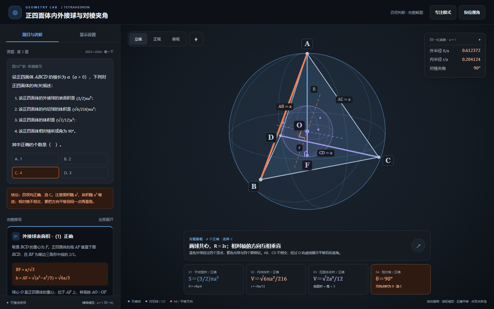

# 正四面体内外接球与对棱夹角 · 参考导读

适用于正四面体、内外接球共心、球与面相切、相对棱夹角和多项判断的固定模型题。沿用外接球示例的完整解题、显示设置、相机、Pointer Events、胶囊标签、抽屉和按需渲染。

- [离线单文件成品](https://github.com/qeqe312/modeling-display/blob/main/examples/%E6%AD%A3%E5%9B%9B%E9%9D%A2%E4%BD%93%E5%86%85%E5%A4%96%E6%8E%A5%E7%90%83%E4%B8%8E%E5%AF%B9%E6%A3%B1%E5%A4%B9%E8%A7%92/%E6%88%90%E5%93%81/%E6%AD%A3%E5%9B%9B%E9%9D%A2%E4%BD%93%E5%86%85%E5%A4%96%E6%8E%A5%E7%90%83%E4%B8%8E%E5%AF%B9%E6%A3%B1%E5%A4%B9%E8%A7%92.html)（[本地](成品/正四面体内外接球与对棱夹角.html)）
- [使用说明](https://github.com/qeqe312/modeling-display/blob/main/examples/%E6%AD%A3%E5%9B%9B%E9%9D%A2%E4%BD%93%E5%86%85%E5%A4%96%E6%8E%A5%E7%90%83%E4%B8%8E%E5%AF%B9%E6%A3%B1%E5%A4%B9%E8%A7%92/%E6%88%90%E5%93%81/%E4%BD%BF%E7%94%A8%E8%AF%B4%E6%98%8E.md)（[本地](成品/使用说明.md)） · [开发资料](https://github.com/qeqe312/modeling-display/blob/main/examples/%E6%AD%A3%E5%9B%9B%E9%9D%A2%E4%BD%93%E5%86%85%E5%A4%96%E6%8E%A5%E7%90%83%E4%B8%8E%E5%AF%B9%E6%A3%B1%E5%A4%B9%E8%A7%92/%E5%BC%80%E5%8F%91%E8%B5%84%E6%96%99/README.md)（[本地](开发资料/README.md)）
- [页面规范](https://github.com/qeqe312/modeling-display/blob/main/references/page-spec.md)（[本地](../../references/page-spec.md)） · [验收标准](https://github.com/qeqe312/modeling-display/blob/main/references/verification.md)（[本地](../../references/verification.md)）

## 原题与数学

2023—2024 高一下，四川广安阶段练习，第 5 题。棱长 a>0；四项描述分别为外接球表面积 (3/2)πa²、内切球体积 √6πa³/216、四面体体积 √2a³/12、相对棱夹角 90°。**四项均正确，选 C：4 个。** 原截图保存在开发资料的题目目录，第（1）项幂次按用户明确确认的 2 记录。

高 h＝√6a/3，外接球半径 R＝3h/4＝√6a/4，内切球半径 r＝h/4＝√6a/12，两球共心且 R＝3r。

以底面中心 F 为原点，x 轴平行 BC（从 B 指向 C），y 轴沿 FD，z 轴沿 FA 向上。令 h＝√6a/3、r＝h/4，教学坐标 A=(0,0,h)、B=(−a/2,−√3a/6,0)、C=(a/2,−√3a/6,0)、D=(0,√3a/3,0)、O=(0,0,r)、F=(0,0,0)。BCD 位于 z＝0 平面。渲染按 a＝1，映射 `(x,y,z)→6(x,z−r,−y)`；逆变换 `(X,Y,Z)→(X/6,−Z/6,Y/6+r)`。

AB·CD＝0，AC·BD＝0，AD·BC＝0。原相对棱为异面直线，模型中的直角画在经过 O、分别平行 AB 和 CD 的两条辅助线上，不能误读为原棱相交。

## 默认状态与控件映射

全部四张推导初始展开；内外球、实体面、AB/CD 高亮、球心高与半径、平移方向及直角开启，坐标轴关闭。字母和边长开启，字号 22px，可调 14–32px。两球面 opacity 初始均为 0.08，滑条范围 0–0.20；选择初始为空，精细度自动。

| DOM 控件 | state | 实际对象 |
|---|---|---|
| cSolid | solid | groups.faces，四个三角面 |
| cSphere | sphere | groups.sphere，外球面、大圆与轮廓 |
| cInner | inner | groups.inner，内球面、大圆、轮廓与四个切点 |
| cOpposite | opposite | groups.opposite，AB 与 CD 叠加高亮 |
| cGuide | guide | groups.guide，AO、OF、F 处直角；控制 O/F 点与标签 |
| cAngles | angles | groups.angles，平移方向线与 O 处直角 |
| cAxes | axes | groups.axes，F 为原点的教学坐标轴；同时显示 F 点与标签 |
| cLabels/cLengths | labels/lengths | DOM 字母 / 边长及半径标签 |
| sOpacity | opacity | 外球与内球两种球面材质 |

坐标轴从 F 发出，x/y 平行底面、z 沿 FA；隐藏辅助线而开启坐标轴时，F 仍可见。隐藏实体面后六条基本棱和四个顶点仍可见、可选；隐藏高亮后基本 AB/CD 棱仍保留。公式概览仅定位讲解，保持所有显示设置、相机和选择。

## 可读实现与重建

`开发资料/源码/layout.html` 是题干、推导、设置和舞台浮层；`style.css` 保留共享暗色布局，仅调整长标题、公式和答案 C；`model.js` 提供坐标、球、棱、切点和图层；`engine.js` 完全沿用前两例的球坐标相机：水平拖动调整方位角，竖直拖动调整仰角，灵敏度均为 0.006 rad/px；仰角限制为 ±1.49 rad，世界竖直方向固定。保留缩放、平移、标签缓存、抽屉和按需渲染。初始和复位视角以 BCD 为水平底面、A 朝上；居中保留当前相机方向。

model.js 打开 IIFE，engine.js 关闭同一个 IIFE，按此顺序组装为同一 script。构建使用当前示例自己的源码及仓库模板、打包器和已校验 Three.js r146；默认只生成单文件 HTML 与说明、许可证，不生成双文件版或 ZIP。

```bash
python "examples/正四面体内外接球与对棱夹角/开发资料/build_demo.py"
node "examples/正四面体内外接球与对棱夹角/开发资料/check_math.mjs"
python "examples/正四面体内外接球与对棱夹角/开发资料/check_browser.py"
python "examples/正四面体内外接球与对棱夹角/开发资料/inspect_demo.py"
python "examples/正四面体内外接球与对棱夹角/开发资料/check_rotation.py"
```

这里的 python 表示当前环境解释器；浏览器检查依赖 Playwright，可用 `GEO3D_BROWSER` 指定现有 Chromium 系浏览器。详细环境见仓库 CONTRIBUTING.md。报告区分独立数学、浏览器可信触摸和实体设备范围。

## 截图

| 视口 | 默认模型 | 显示设置 | 完整解答中的结论 |
|---|---|---|---|
| 电脑 1600×1000 | [模型与题干](https://github.com/qeqe312/modeling-display/blob/main/examples/%E6%AD%A3%E5%9B%9B%E9%9D%A2%E4%BD%93%E5%86%85%E5%A4%96%E6%8E%A5%E7%90%83%E4%B8%8E%E5%AF%B9%E6%A3%B1%E5%A4%B9%E8%A7%92/%E5%BC%80%E5%8F%91%E8%B5%84%E6%96%99/%E9%AA%8C%E8%AF%81%E8%AE%B0%E5%BD%95/%E6%88%AA%E5%9B%BE/desktop.png)（[本地](开发资料/验证记录/截图/desktop.png)） | [设置](https://github.com/qeqe312/modeling-display/blob/main/examples/%E6%AD%A3%E5%9B%9B%E9%9D%A2%E4%BD%93%E5%86%85%E5%A4%96%E6%8E%A5%E7%90%83%E4%B8%8E%E5%AF%B9%E6%A3%B1%E5%A4%B9%E8%A7%92/%E5%BC%80%E5%8F%91%E8%B5%84%E6%96%99/%E9%AA%8C%E8%AF%81%E8%AE%B0%E5%BD%95/%E6%88%AA%E5%9B%BE/desktop-settings.png)（[本地](开发资料/验证记录/截图/desktop-settings.png)） | [答案](https://github.com/qeqe312/modeling-display/blob/main/examples/%E6%AD%A3%E5%9B%9B%E9%9D%A2%E4%BD%93%E5%86%85%E5%A4%96%E6%8E%A5%E7%90%83%E4%B8%8E%E5%AF%B9%E6%A3%B1%E5%A4%B9%E8%A7%92/%E5%BC%80%E5%8F%91%E8%B5%84%E6%96%99/%E9%AA%8C%E8%AF%81%E8%AE%B0%E5%BD%95/%E6%88%AA%E5%9B%BE/desktop-answer.png)（[本地](开发资料/验证记录/截图/desktop-answer.png)） |
| 平板竖屏 820×1180 | [模型](https://github.com/qeqe312/modeling-display/blob/main/examples/%E6%AD%A3%E5%9B%9B%E9%9D%A2%E4%BD%93%E5%86%85%E5%A4%96%E6%8E%A5%E7%90%83%E4%B8%8E%E5%AF%B9%E6%A3%B1%E5%A4%B9%E8%A7%92/%E5%BC%80%E5%8F%91%E8%B5%84%E6%96%99/%E9%AA%8C%E8%AF%81%E8%AE%B0%E5%BD%95/%E6%88%AA%E5%9B%BE/portrait.png)（[本地](开发资料/验证记录/截图/portrait.png)） | [底部抽屉](https://github.com/qeqe312/modeling-display/blob/main/examples/%E6%AD%A3%E5%9B%9B%E9%9D%A2%E4%BD%93%E5%86%85%E5%A4%96%E6%8E%A5%E7%90%83%E4%B8%8E%E5%AF%B9%E6%A3%B1%E5%A4%B9%E8%A7%92/%E5%BC%80%E5%8F%91%E8%B5%84%E6%96%99/%E9%AA%8C%E8%AF%81%E8%AE%B0%E5%BD%95/%E6%88%AA%E5%9B%BE/portrait-settings.png)（[本地](开发资料/验证记录/截图/portrait-settings.png)） | [答案](https://github.com/qeqe312/modeling-display/blob/main/examples/%E6%AD%A3%E5%9B%9B%E9%9D%A2%E4%BD%93%E5%86%85%E5%A4%96%E6%8E%A5%E7%90%83%E4%B8%8E%E5%AF%B9%E6%A3%B1%E5%A4%B9%E8%A7%92/%E5%BC%80%E5%8F%91%E8%B5%84%E6%96%99/%E9%AA%8C%E8%AF%81%E8%AE%B0%E5%BD%95/%E6%88%AA%E5%9B%BE/portrait-answer.png)（[本地](开发资料/验证记录/截图/portrait-answer.png)） |
| 平板横屏 1180×820 | [模型](https://github.com/qeqe312/modeling-display/blob/main/examples/%E6%AD%A3%E5%9B%9B%E9%9D%A2%E4%BD%93%E5%86%85%E5%A4%96%E6%8E%A5%E7%90%83%E4%B8%8E%E5%AF%B9%E6%A3%B1%E5%A4%B9%E8%A7%92/%E5%BC%80%E5%8F%91%E8%B5%84%E6%96%99/%E9%AA%8C%E8%AF%81%E8%AE%B0%E5%BD%95/%E6%88%AA%E5%9B%BE/landscape.png)（[本地](开发资料/验证记录/截图/landscape.png)） | [左侧抽屉](https://github.com/qeqe312/modeling-display/blob/main/examples/%E6%AD%A3%E5%9B%9B%E9%9D%A2%E4%BD%93%E5%86%85%E5%A4%96%E6%8E%A5%E7%90%83%E4%B8%8E%E5%AF%B9%E6%A3%B1%E5%A4%B9%E8%A7%92/%E5%BC%80%E5%8F%91%E8%B5%84%E6%96%99/%E9%AA%8C%E8%AF%81%E8%AE%B0%E5%BD%95/%E6%88%AA%E5%9B%BE/landscape-settings.png)（[本地](开发资料/验证记录/截图/landscape-settings.png)） | [答案](https://github.com/qeqe312/modeling-display/blob/main/examples/%E6%AD%A3%E5%9B%9B%E9%9D%A2%E4%BD%93%E5%86%85%E5%A4%96%E6%8E%A5%E7%90%83%E4%B8%8E%E5%AF%B9%E6%A3%B1%E5%A4%B9%E8%A7%92/%E5%BC%80%E5%8F%91%E8%B5%84%E6%96%99/%E9%AA%8C%E8%AF%81%E8%AE%B0%E5%BD%95/%E6%88%AA%E5%9B%BE/landscape-answer.png)（[本地](开发资料/验证记录/截图/landscape-answer.png)） |
| 手机 390×844 | [模型](https://github.com/qeqe312/modeling-display/blob/main/examples/%E6%AD%A3%E5%9B%9B%E9%9D%A2%E4%BD%93%E5%86%85%E5%A4%96%E6%8E%A5%E7%90%83%E4%B8%8E%E5%AF%B9%E6%A3%B1%E5%A4%B9%E8%A7%92/%E5%BC%80%E5%8F%91%E8%B5%84%E6%96%99/%E9%AA%8C%E8%AF%81%E8%AE%B0%E5%BD%95/%E6%88%AA%E5%9B%BE/phone.png)（[本地](开发资料/验证记录/截图/phone.png)） | [设置](https://github.com/qeqe312/modeling-display/blob/main/examples/%E6%AD%A3%E5%9B%9B%E9%9D%A2%E4%BD%93%E5%86%85%E5%A4%96%E6%8E%A5%E7%90%83%E4%B8%8E%E5%AF%B9%E6%A3%B1%E5%A4%B9%E8%A7%92/%E5%BC%80%E5%8F%91%E8%B5%84%E6%96%99/%E9%AA%8C%E8%AF%81%E8%AE%B0%E5%BD%95/%E6%88%AA%E5%9B%BE/phone-settings.png)（[本地](开发资料/验证记录/截图/phone-settings.png)） | [答案](https://github.com/qeqe312/modeling-display/blob/main/examples/%E6%AD%A3%E5%9B%9B%E9%9D%A2%E4%BD%93%E5%86%85%E5%A4%96%E6%8E%A5%E7%90%83%E4%B8%8E%E5%AF%B9%E6%A3%B1%E5%A4%B9%E8%A7%92/%E5%BC%80%E5%8F%91%E8%B5%84%E6%96%99/%E9%AA%8C%E8%AF%81%E8%AE%B0%E5%BD%95/%E6%88%AA%E5%9B%BE/phone-answer.png)（[本地](开发资料/验证记录/截图/phone-answer.png)） |



坐标轴与底面朝向：[电脑](https://github.com/qeqe312/modeling-display/blob/main/examples/%E6%AD%A3%E5%9B%9B%E9%9D%A2%E4%BD%93%E5%86%85%E5%A4%96%E6%8E%A5%E7%90%83%E4%B8%8E%E5%AF%B9%E6%A3%B1%E5%A4%B9%E8%A7%92/%E5%BC%80%E5%8F%91%E8%B5%84%E6%96%99/%E9%AA%8C%E8%AF%81%E8%AE%B0%E5%BD%95/%E6%88%AA%E5%9B%BE/desktop-axes.png)（[本地](开发资料/验证记录/截图/desktop-axes.png)）、[平板竖屏](https://github.com/qeqe312/modeling-display/blob/main/examples/%E6%AD%A3%E5%9B%9B%E9%9D%A2%E4%BD%93%E5%86%85%E5%A4%96%E6%8E%A5%E7%90%83%E4%B8%8E%E5%AF%B9%E6%A3%B1%E5%A4%B9%E8%A7%92/%E5%BC%80%E5%8F%91%E8%B5%84%E6%96%99/%E9%AA%8C%E8%AF%81%E8%AE%B0%E5%BD%95/%E6%88%AA%E5%9B%BE/portrait-axes.png)（[本地](开发资料/验证记录/截图/portrait-axes.png)）、[平板横屏](https://github.com/qeqe312/modeling-display/blob/main/examples/%E6%AD%A3%E5%9B%9B%E9%9D%A2%E4%BD%93%E5%86%85%E5%A4%96%E6%8E%A5%E7%90%83%E4%B8%8E%E5%AF%B9%E6%A3%B1%E5%A4%B9%E8%A7%92/%E5%BC%80%E5%8F%91%E8%B5%84%E6%96%99/%E9%AA%8C%E8%AF%81%E8%AE%B0%E5%BD%95/%E6%88%AA%E5%9B%BE/landscape-axes.png)（[本地](开发资料/验证记录/截图/landscape-axes.png)）、[手机](https://github.com/qeqe312/modeling-display/blob/main/examples/%E6%AD%A3%E5%9B%9B%E9%9D%A2%E4%BD%93%E5%86%85%E5%A4%96%E6%8E%A5%E7%90%83%E4%B8%8E%E5%AF%B9%E6%A3%B1%E5%A4%B9%E8%A7%92/%E5%BC%80%E5%8F%91%E8%B5%84%E6%96%99/%E9%AA%8C%E8%AF%81%E8%AE%B0%E5%BD%95/%E6%88%AA%E5%9B%BE/phone-axes.png)（[本地](开发资料/验证记录/截图/phone-axes.png)）。
